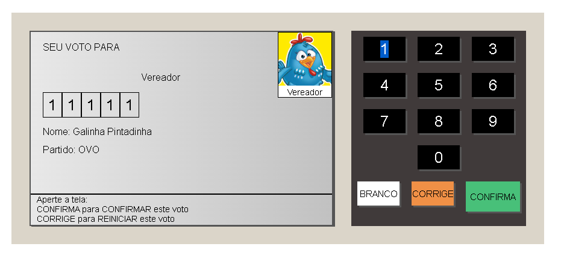
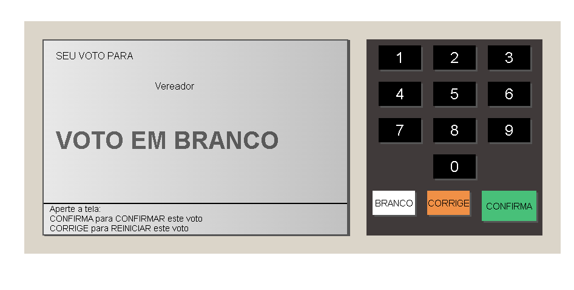
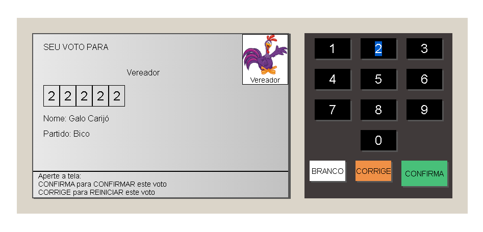
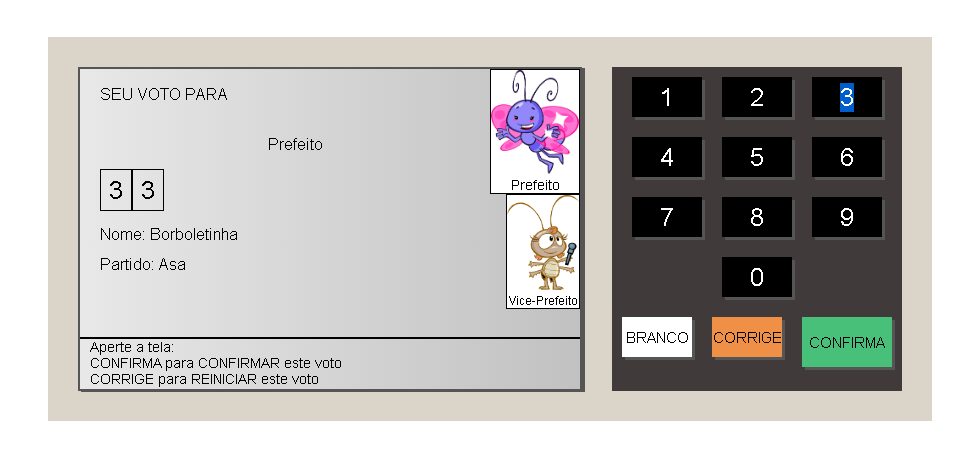
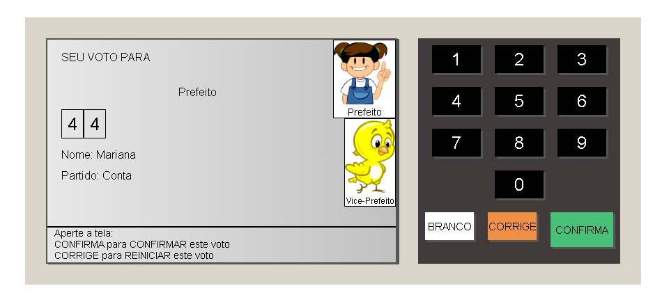
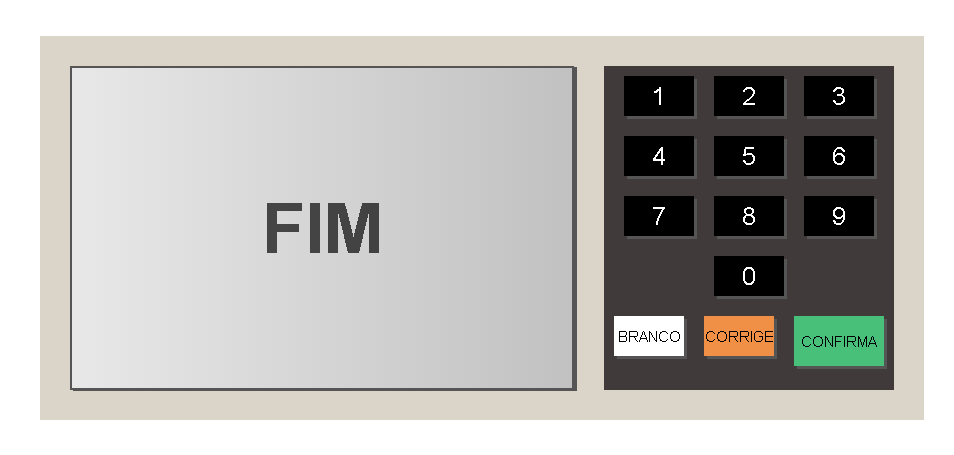

# Projeto URNA ELETRÔNICA

## 🛠 Tecnologias

* HTML
* CSS
* JavaScript

[Clique aqui para acessar o projeto](https://aelanderfarias.github.io/urna-eletronica/)

## 🇧🇷 "Boca de urna" 
> Vereador
* 11111 - Galinha Pintadinha
* 22222 - Galo Carijó
>Prefeito
* 33 - Borboletinha - Vice: Baratinha
* 44 - Mariana - Vice: Pintinho

